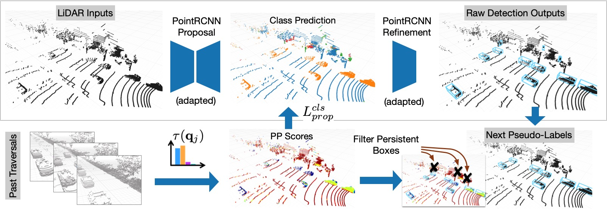

# Unsupervised Adaptation from Repeated Traversals for Autonomous Driving
This is the official code release for
[[NeurIPS 2022] **Unsupervised Adaptation from Repeated Traversals for Autonomous Driving**](https://openreview.net/pdf?id=0fKlU1OlANc).

by [Yurong You](https://yurongyou.com/)\*, [Katie Z Luo](https://www.cs.cornell.edu/~katieluo/)\*, [Cheng Perng Phoo](https://www.cs.cornell.edu/~cpphoo/)\*, [Travis Zhang](https://github.com/zhangtravis),[Wei-Lun Chao](https://sites.google.com/view/wei-lun-harry-chao), [Bharath Hariharan](http://home.bharathh.info/), [Mark Campbell](https://research.cornell.edu/researchers/mark-campbell), and [Kilian Q. Weinberger](https://www.cs.cornell.edu/~kilian/)

[Paper](https://openreview.net/pdf?id=0fKlU1OlANc) | [Video](https://nips.cc/virtual/2022/poster/53349)

**Interested in perception with multiple traversals? Also see [Hindsight is 20/20](https://github.com/YurongYou/Hindsight) and [MODEST](https://github.com/YurongYou/MODEST).**



### Abstract
For a self-driving car to operate reliably, its perceptual system must generalize to the end-user’s environment – ideally without additional annotation efforts. One potential solution is to leverage unlabeled data (e.g., unlabeled LiDAR point clouds) collected from the end-users' environments (i.e. target domain) to adapt the system to the difference between training and testing environments. While extensive research has been done on such an unsupervised domain adaptation problem, one fundamental problem lingers: there is no reliable signal in the target domain to supervise the adaptation process. To overcome this issue we observe that it is easy to collect unsupervised data from multiple traversals of repeated routes. While different from conventional unsupervised domain adaptation, this assumption is extremely realistic since many drivers share the same roads. We show that this simple additional assumption is sufficient to obtain a potent signal that allows us to perform iterative self-training of 3D object detectors on the target domain. Concretely, we generate pseudo-labels with the out-of-domain detector but reduce false positives by removing detections of supposedly mobile objects that are persistent across traversals. Further, we reduce false negatives by encouraging predictions in regions that are not persistent. We experiment with our approach on two large-scale driving datasets and show remarkable improvement in 3D object detection of cars, pedestrians, and cyclists, bringing us a step closer to generalizable autonomous driving.

### Citation
```
@inproceedings{you2022unsupervised,
  title = {Unsupervised Adaptation from Repeated Traversals for Autonomous Driving},
  author = {You, Yurong and Phoo, Cheng Perng and Luo, Katie Z and Zhang, Travis and Chao, Wei-Lun and Hariharan, Bharath and Campbell, Mark and Weinberger, Kilian Q.},
  booktitle = {Proceedings of the Conference on Neural Information Processing Systems (NeurIPS)},
  year = {2022},
  month = dec
}
```

## Environment Setup

Setup with Anaconda environment:

```bash
conda create --name adaptation python=3.8
conda activate adaptation
conda install pytorch=1.9.0 torchvision torchaudio cudatoolkit=11.1 -c pytorch -c nvidia
pip install opencv-python matplotlib ray wandb scipy tqdm easydict scikit-learn pillow==8.3.2
```

Install some necessary dependencies, and build the project. Rote-DA is built off of the [OpenPCDet framework](https://github.com/open-mmlab/OpenPCDet):

```bash
# install openpcdet
cd ../../../downstream/OpenPCDet
pip install -r requirements.txt
python setup.py develop

# for managing experiments
pip install hydra-core --upgrade
pip install hydra_colorlog --upgrade
pip install rich
```

Install [Minkowski Engine](https://github.com/NVIDIA/MinkowskiEngine.git):

```bash
# ME
git clone https://github.com/NVIDIA/MinkowskiEngine.git
cd MinkowskiEngine
git checkout c854f0c # 0.5.4
# NOTE: need to run this on a node with GPUs
python setup.py install
```

Install a custom [Spatially Sparse Convolution Library](https://github.com/traveller59/spconv) build:

```bash
# install customized spconv
cd third_party/spconv
python setup.py bdist_wheel
cd ./dist
pip install spconv-1.2.1-cp38-cp38-linux_x86_64.whl
```

## Running Adaptation Training
#### Preprocessing data
Please refer to [`data_preprocessing/lyft/LYFT_PREPROCESSING.md`](data_preprocessing/lyft/LYFT_PREPROCESSING.md) and
[`data_preprocessing/ithaca365/ITHACA365_PREPROCESSING.md`](data_preprocessing/ithaca365/ITHACA365_PREPROCESSING.md).

#### Precomputing P2 Scores
Begin by ensuring the paths are correct during pre-processing, as there are some references that are used for the next step.

To generate P2 score to adapt to the *Lyft* dataset:
```bash
cd $PROJECT_ROOT_DIR
# generate pp score
python p2_score/pre_compute_p2_score.py
```

To generate P2 score to adapt to the *Ithaca* dataset:
```bash
cd $PROJECT_ROOT_DIR
# generate pp score
python p2_score/pre_compute_p2_score.py dataset="ithaca365" data_paths="ithaca365.yaml"
```

Make sure to motify the field `load_p2_score` in the [lyft model config](downstream/OpenPCDet/tools/cfgs/lyft_models/pointrcnn_rote_domain_adapt.yaml) and `LOAD_P2_SCORE` in the [ithaca365 model config](downstream/OpenPCDet/tools/cfgs/ithaca365_models/pointrcnn_rote_domain_adapt.yaml) with these paths.

#### Generate model on source domain
We provide code for training your own source domain model that you will adapt from. In our work, we adapt from the KITTI dataset:

```bash
# Train a model on the KITTI dataset
bash scripts/dist_train.sh 4 --cfg_file cfgs/kitti_models/pointrcnn.yaml --extra_tag scratch_xyz_kitti --merge_all_iters_to_one_epoch --fix_random_seed

# Generate initial pseudo-labels from model predictions 
bash scripts/dist_test.sh 4 --cfg_file cfgs/lyft_models/pointrcnn.yaml --ckpt $(pwd)/downstream/OpenPCDet/output/kitti_models/pointrcnn/baseline_xyz/ckpt/last_checkpoint.pth --eval_tag eval_train --set DATA_CONFIG.DATA_SPLIT.test train DATA_CONFIG.INFO_PATH.test kitti_infos_train.pkl
```

We also provide our checkpoint in the "Model Checkpoints" section below.

#### Launch Training
To launch training, activate the conda environment and run the following self-training scripts:

```bash
# Lyft
./scripts/self_training_adaptation_lyft.sh -F kitti_to_lyft_pointrcnn_roteda_%s -s $(pwd)/downstream/OpenPCDet/output/lyft_models/pointrcnn_eval/kitti_baseline/eval/epoch_no_number/train/eval_train/result.pkl -m pointrcnn_rote_domain_adapt -S <KITTI_CHECKPOINT_PATH>

# Ithaca365
./scripts/self_training_adaptation_ith365.sh -F kitti_to_ith365_pointrcnn_roteda_%s -s $(pwd)/downstream/OpenPCDet/output/ithaca365_models/pointrcnn_eval/kitti_baseline/eval/epoch_no_number/train/eval_train/result.pkl -m pointrcnn_rote_domain_adapt -S <KITTI_CHECKPOINT_PATH>
```

#### Evaluate all Checkpoints
Evaluation can be done on each checkpoint with `scripts/dist_test.sh`. We provide a bash script to evaluate all rounds of Rote-DA self-training. Activate the conda environment and run the following eval scripts:
```bash
./scripts/eval_all_ckpt.sh -F kitti_to_lyft_pointrcnn_roteda_%s -m pointrcnn_rote_domain_adapt
```

## Model Checkpoints

We provide necessary checkpoints for our experiment for source model, as well as models adapted to Lyft and Ithaca365.

#### Source Model
To recreate results from our experiment, remember to set the used features on the source training to use only the `x, y, z` features (this is already set in the config provided). Model checkpoint and config are provided below:

| Model | Checkpoint  | Config file |
| ----- | :----: | :----: |
| PointRCNN | [link](https://drive.google.com/file/d/1A-ZZ4PdutAvEM9RfG8W9Xrw7dbg3VEcF/view?usp=share_link) | [cfg](downstream/OpenPCDet/tools/cfgs/kitti_models/pointrcnn.yaml) |

#### Lyft Experiment Models
Below we provide checkpoints for round 0, 5, and 10 of self-training adaptation on Lyft. Results reported in the paper are on round 10.

| Model | ST rounds | Checkpoint  | Config file |
| ----- | :----:  | :----: | :----: |
| PointRCNN | 0 | [link](https://drive.google.com/file/d/109V-ZsWQYL1N5zgGncesq6Rta2T2ao2I/view?usp=share_link) | [cfg](downstream/OpenPCDet/tools/cfgs/lyft_models/pointrcnn_rote_domain_adapt.yaml) |
| PointRCNN | 5 | [link](https://drive.google.com/file/d/1OqtMGwZYU9keS3Y4g5zzmU3G18f25Jsc/view?usp=share_link) | [cfg](downstream/OpenPCDet/tools/cfgs/lyft_models/pointrcnn_rote_domain_adapt.yaml) |
| PointRCNN | 10 | [link](https://drive.google.com/file/d/1ifW2JWjGIiw6GmpVG-KgMKYOoz7e9hsn/view?usp=share_link) | [cfg](downstream/OpenPCDet/tools/cfgs/lyft_models/pointrcnn_rote_domain_adapt.yaml) |


#### Ithaca365 Experiment Models
Below we provide checkpoints for round 0, 5, and 10 of self-training adaptation on Ithaca365. Results reported in the paper are on round 10.

| Model | ST rounds | Checkpoint  | Config file |
| ----- | :----:  | :----: | :----: |
| PointRCNN | 0 | [link](https://drive.google.com/file/d/10UzMY_fa-axvE9d2LrnhvUl4N4HLc2_e/view?usp=share_link) | [cfg](downstream/OpenPCDet/tools/cfgs/ithaca365_models/pointrcnn_rote_domain_adapt.yaml) |
| PointRCNN | 5 | [link](https://drive.google.com/file/d/1AL-TLcm65NT_kR-q4wPZ1ADYoiIVfReY/view?usp=share_link) | [cfg](downstream/OpenPCDet/tools/cfgs/ithaca365_models/pointrcnn_rote_domain_adapt.yaml) |
| PointRCNN | 10 | [link](https://drive.google.com/file/d/1GeKMQG8o_-wSUXTagLn0ubTkoaltsOwG/view?usp=share_link) | [cfg](downstream/OpenPCDet/tools/cfgs/ithaca365_models/pointrcnn_rote_domain_adapt.yaml) |
